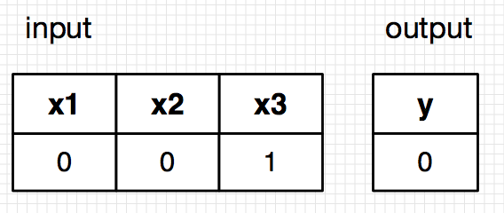
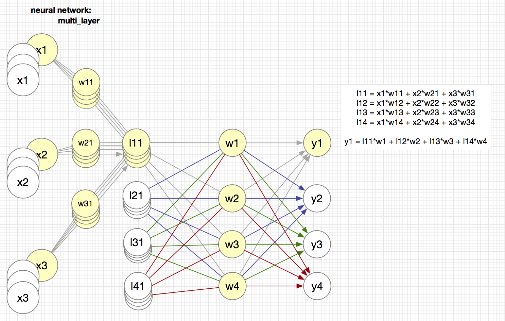

# Neural Network

### Training flow


### Testing flow


## Single layer

Overview


Single layer Neural network


Training data set


=> Single data set



Result
```
Weights After Training:
[[ 9.67299303]
 [-0.2078435 ]
 [-4.62963669]]


TESTING
- Out1: without transfer function
- Out2: with transfer function

Input      Out1            Out2      
[0 0 0]    [0.5]           [0.]      
[0 0 1]    [0.009664]      [0.]      
[0 1 0]    [0.44822538]    [0.]      
[0 1 1]    [0.00786466]    [0.]      
[1 0 0]    [0.99993704]    [1.]      
[1 0 1]    [0.99358931]    [1.]      
[1 1 0]    [0.9999225]     [1.]      
[1 1 1]    [0.99211997]    [1.]
```
## Multi layer
Multi layer Neural network



Multi layer training


Result
```
Weights After Training:
[[-2.45237664  4.24246073 -4.51602703  0.20084556]
 [-0.37852498 -0.46226218  0.03227375 -0.22607559]
 [ 0.70578881 -1.40848121  1.82311171  0.44840252]]


TESTING
- Out1: without transfer function
- Out2: with transfer function

Input      Out1            Out2      
[0 0 0]    [0.27607508]    [0.]      
[0 0 1]    [0.00510202]    [0.]      
[0 1 0]    [0.18696632]    [0.]      
[0 1 1]    [0.00421865]    [0.]      
[1 0 0]    [0.99742832]    [1.]      
[1 0 1]    [0.99493902]    [1.]      
[1 1 0]    [0.99737872]    [1.]      
[1 1 1]    [0.99437194]    [1.] 
```


Explanation:

- numpy: https://docs.scipy.org/doc/numpy/reference/routines.html
- random.seed: https://en.wikipedia.org/wiki/Deterministic_algorithm
- sigmoid: https://en.wikipedia.org/wiki/Sigmoid_function
- slope: https://en.wikipedia.org/wiki/Slope
- sigmoid derivative: https://en.wikipedia.org/wiki/Logistic_function

